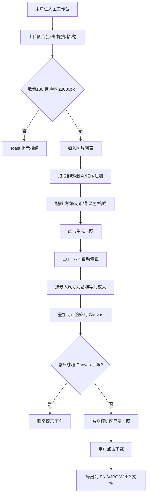

## 1. 产品概述

拼图工具是一款纯前端 Web 应用,核心解决"将多张不同尺寸图片拼接为一张长图"的问题。通过宽度/高度对齐 + 等比放大的规则,保证拼接结果整齐美观,同时支持上传、排序、间距配置、多格式输出等完整能力,无需后端,浏览器内即可完成全部处理。

- 目标用户:需要整理截图、制作长图说明、拼接设计稿的普通用户和内容创作者
- 核心价值:零依赖、零上传隐私安全、操作直观、输出专业

## 2. 核心功能

### 2.1 用户角色

无角色区分,所有访客均可使用全部功能。

### 2.2 功能模块

1. **主工作台(单页应用)**:上传区、图片列表、拼接配置、生成按钮、预览与下载

### 2.3 页面详情

| 页面名称 | 模块名称 | 功能描述 |
|---------|---------|---------|
| 主工作台 | 上传区 | 支持点击选择、拖拽上传、Ctrl+V 粘贴三种方式;支持多文件;数量>30 张或单图最长边>8000px 时硬拒绝并 toast 提示 |
| 主工作台 | 图片列表 | 横向缩略图行,每项含序号 + 缩略图 + 删除按钮;支持拖拽排序;可继续追加 |
| 主工作台 | 拼接配置 | 方向(垂直/水平)、间距数值(px)、背景色取色器(支持透明)、输出格式(PNG/JPG/WebP)、质量滑块(仅 JPG/WebP 显示) |
| 主工作台 | 生成按钮 | 点击执行拼接;总尺寸超 Canvas 上限时弹窗提示;生成中显示 loading |
| 主工作台 | 预览与下载 | 生成前显示占位说明;生成后显示可缩放查看的长图预览、输出信息(尺寸/格式)、下载按钮 |

## 3. 核心流程

用户进入主工作台后,通过上传区添加图片(本地上传/拖拽/粘贴)→ 系统校验数量(≤30)和单图尺寸(最长边≤8000px),超限拒绝并提示 → 图片显示在列表中,用户可拖拽排序或删除 → 在拼接配置区选择方向(垂直/水平)、设置间距与背景色、选择输出格式与质量 → 点击"生成长图"→ 系统自动修正 EXIF 方向,按最大宽度(垂直)或最大高度(水平)为基准等比放大其他图,叠加间距后渲染到 Canvas → 总尺寸超 Canvas 上限则提示,否则显示预览 → 用户确认后点击下载,导出为指定格式文件。

## 4. 用户界面设计

### 4.1 设计风格

- **整体定位**:专业工具感 + 现代克制美学,避免花哨装饰,突出工作区效率
- **主色调**:深炭灰底(#1a1a1f) + 暖白前景(#f5f5f0),点缀电光青(#00e0c6)作为主操作色,营造工程师工具的冷静质感
- **辅助色**:警示橙(#ff6b35)用于删除/超限提示,中性灰阶用于分隔与禁用态
- **字体**:标题使用具有几何识别度的 "Space Grotesk"(或同等独特无衬线),正文使用 "JetBrains Mono" 等宽体强化工具感,中文回退到系统等宽
- **按钮风格**:主按钮采用实心青色 + 微妙下沉阴影;次按钮采用描边镂空;圆角统一 8px
- **布局**:左右分栏(左侧控制区 40%,右侧预览区 60%),顶部细条标题栏
- **图标**:线性极简 SVG,2px 描边,无填充,与等宽字体呼应
- **氛围细节**:背景添加极轻噪点纹理,卡片采用 1px 边框 + 微妙内发光,hover 时有轻微 translateY 位移

### 4.2 页面设计概览

| 页面名称 | 模块名称 | UI 元素 |
|---------|---------|---------|
| 主工作台 | 顶部标题栏 | 细条状,左:工具名 "MOSAIC",右:简短操作提示文字 |
| 主工作台 | 左侧上传区 | 虚线边框占位框,中央显示"点击 / 拖拽 / 粘贴"图标与文字,hover 高亮 |
| 主工作台 | 左侧图片列表 | 横向缩略图行,每项 80×80px,左上角序号徽章,右上角删除按钮,拖拽时半透明 + 目标位虚线指示 |
| 主工作台 | 左侧拼接配置 | 表单分组:方向(双按钮切换)、间距(数字输入 + 单位 px)、背景色(色块 + 取色器 + 透明开关)、格式(三按钮切换)、质量(滑块 0-100) |
| 主工作台 | 左侧生成按钮 | 全宽主按钮,青色实心,点击后变为 loading 旋转图标 + "生成中…" |
| 主工作台 | 右侧预览区 | 生成前:居中灰色占位文字 + 使用说明;生成后:预览图(可滚轮缩放、拖动平移) + 底部信息条(尺寸/格式) + 下载按钮 |

### 4.3 响应式

- 桌面优先(≥1024px):左右分栏布局,完整功能
- 平板(768-1023px):左右分栏比例调整为 45%/55%,缩略图略缩小
- 移动端(<768px):转为上下单列流式,上传区在上,配置折叠为可展开面板,预览区在下

### 4.4 3D 场景

不适用。
