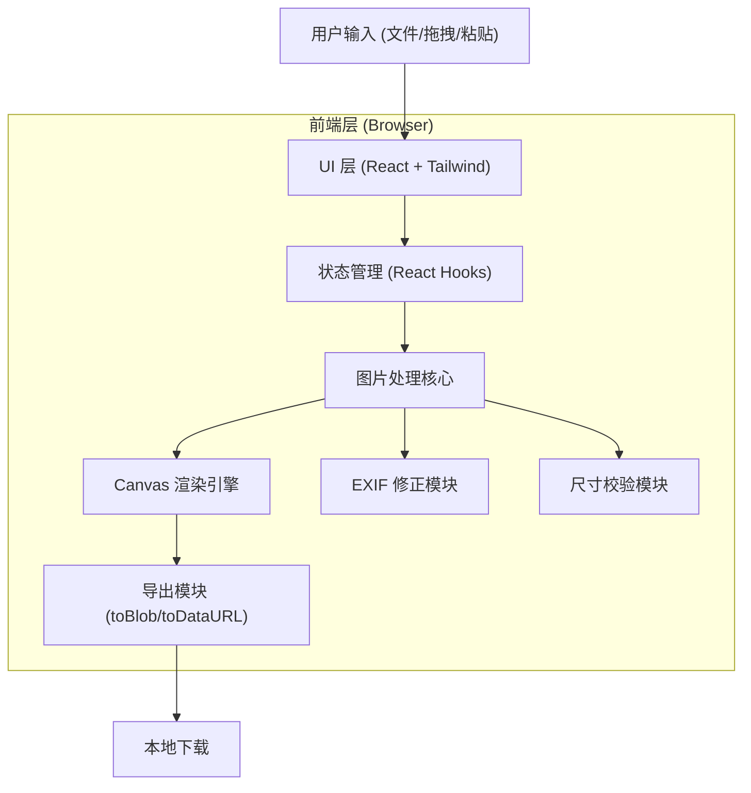

## 1. 架构设计

纯前端单页应用,无后端服务。所有图片处理在浏览器内通过 Canvas API 完成,隐私安全且零服务器成本。



## 2. 技术说明

- **前端框架**: React 18 + TypeScript
- **样式方案**: Tailwind CSS 3
- **构建工具**: Vite
- **初始化工具**: vite-init (react-ts 模板)
- **拖拽排序**: @dnd-kit/core + @dnd-kit/sortable(轻量、无障碍友好)
- **EXIF 解析**: exifr(轻量、支持方向标签)
- **后端**: 无
- **数据库**: 无(纯客户端,不持久化)

## 3. 路由定义

| 路由 | 用途 |
|------|------|
| / | 主工作台,承载全部功能(单页应用,无需多路由) |

## 4. API 定义

无后端 API。所有数据流在客户端内完成:

- **输入**:File 对象(来自 input、drop、paste 事件)
- **处理**:File → ImageBitmap → Canvas → Blob
- **输出**:Blob → 下载文件

## 5. 服务端架构

不适用(纯前端)。

## 6. 数据模型

### 6.1 数据模型定义

无持久化数据库,所有数据为客户端运行时状态。

```mermaid
erDiagram
    ImageItem ||--|| ExifInfo : "包含"
    ProjectState ||--o{ ImageItem : "管理"
    ProjectState ||--|| StitchConfig : "使用"
    ProjectState {
        imageItems "图片列表"
        config "拼接配置"
        result "生成结果"
        status "idle|generating|done|error"
    }
    ImageItem {
        id "唯一标识"
        file "原始 File"
        bitmap "解码后位图"
        width "原始宽度"
        height "原始高度"
        order "排序序号"
    }
    ExifInfo {
        orientation "EXIF 方向值"
    }
    StitchConfig {
        direction "vertical|horizontal"
        gap "间距 px"
        bgColor "背景色 含透明"
        format "png|jpeg|webp"
        quality "0-100"
    }
```

### 6.2 核心算法逻辑(伪代码)

```text
// 拼接核心算法
function stitch(images, config):
    // 1. EXIF 修正后获取实际宽高
    realSizes = images.map(applyExif)

    // 2. 确定基准尺寸
    if config.direction == 'vertical':
        baseSize = max(realSizes.width)   // 最大宽度
    else:
        baseSize = max(realSizes.height)  // 最大高度

    // 3. 等比放大计算每张图的目标尺寸
    targets = realSizes.map(img =>
        if vertical:
            scale = baseSize / img.width
            return { w: baseSize, h: img.height * scale }
        else:
            scale = baseSize / img.height
            return { w: img.width * scale, h: baseSize }
    )

    // 4. 计算总画布尺寸(含间距)
    if vertical:
        totalW = baseSize
        totalH = sum(targets.h) + gap * (n - 1)
    else:
        totalW = sum(targets.w) + gap * (n - 1)
        totalH = baseSize

    // 5. 校验 Canvas 上限(Chrome 约 16384px 边长 + 总像素限制)
    if max(totalW, totalH) > CANVAS_LIMIT:
        throw '总尺寸超出浏览器限制,请减少图片或缩小尺寸'

    // 6. 依次绘制到 Canvas
    canvas = create(totalW, totalH)
    fillBackground(canvas, bgColor)
    cursor = 0
    for img, target in zip(images, targets):
        drawImage(canvas, img, target, cursor)
        cursor += (vertical ? target.h : target.w) + gap

    // 7. 导出
    return canvas.toBlob(format, quality)
```

## 7. 关键技术约束

- **Canvas 尺寸上限**:Chrome 约 16384px 单边、总像素约 268M;Firefox/Safari 更小。拼接前必须校验,超限提示而非尝试渲染。
- **EXIF 方向**:手机拍照默认带 orientation 标签,需通过 exifr 读取并在绘制前用 Canvas transform 旋转修正,否则拼接结果方向错乱。
- **JPG 透明兼容**:JPG 不支持透明通道,输出 JPG 时若背景色为透明,自动转为白底。
- **内存管理**:大图解码后的 ImageBitmap 在使用完毕后显式 close(),避免内存累积;生成完成后释放中间 Canvas。
- **粘贴事件监听**:在 window 级监听 paste 事件,从 clipboardData.items 提取图片类型文件,与文件上传走同一入口。
